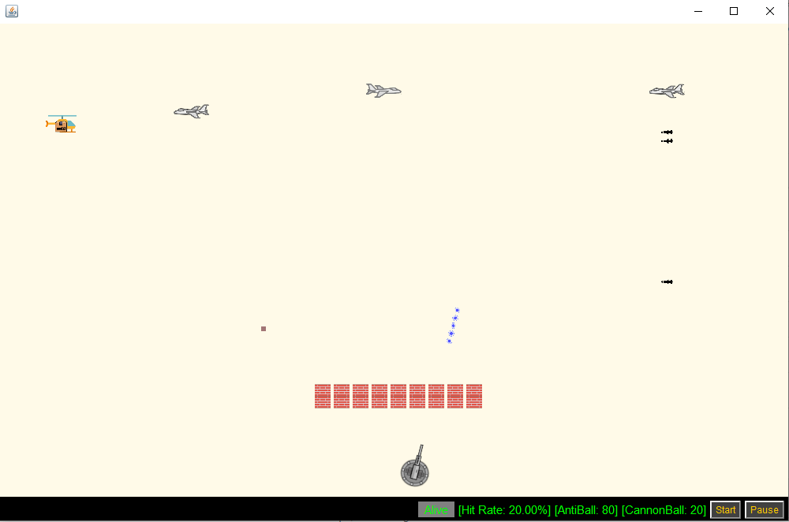
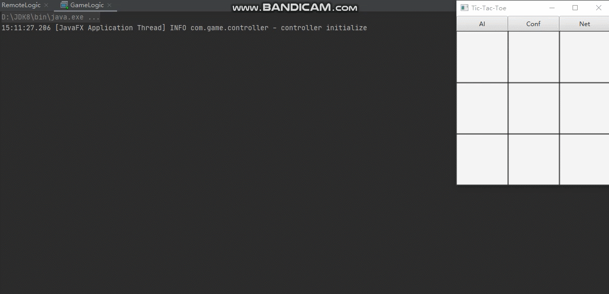
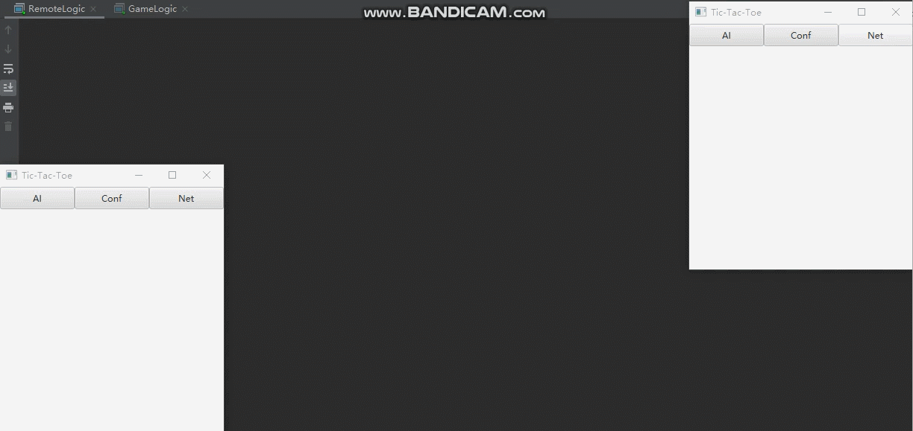
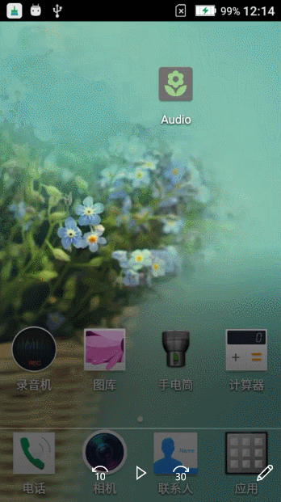

## Resume

- Milylg
- China, Lu'an
- NSU / Software Engineering

## Contant me

- **Email**：lgen.nsu@qq.com

## Project List (Toy)

- **Crazy** (练习重构，Git工具，OOD 案例游戏项目)

- **Tic-Tae-Toc**（练习网络编程，Socket 案例游戏项目，回溯算法，极大极小α-β剪枝算法）

- **Audio** （英语听力播放器，Android端）

- **NEditArea**（基于Layout实现的文本编辑器，开源项目重构）

- **LightEditText** （基于Span实现的文本编辑器，开源项目重构）
- **EditableSpinner**（可编辑的Spinner组件，开源项目重构）

- **DailyNotes**（每日备忘录应用程序，独立开发，Developing...）

## Project Preview

Crazy 游戏项目
  

Crazy Show Case
  

井字棋游戏项目（AI, 网络连线对战）
  

井字棋 AI Show Case
  

井字棋本地网络端口连接 Show Case
  

英语听力播放器项目
  

基于Span的富文本编辑器项目（DailyNotes项目组件库）
  

具有编辑能力，输入可自动提示的Spinner（DailyNotes项目组件库）
  

迭代开发中的DailyNotes项目
