## 项目故事 (Story of Toy Project)

> #### Crazy 游戏程序

回想一下你的童年中，有没有一款你喜爱的游戏呢？即使你不是一个游戏迷，也可能有一些回忆建立在某些曾经痴迷的事物上。有一款在我的中学时期玩过的游戏让我记忆犹新------疯狂鼹鼠，它是一个运行在摩托罗拉E2的单机策略游戏。

我不清楚为什么会对这类游戏着迷，或许是它的策略性和自由度吧；或许是某段生活经历与它绑定在同一个时空，恰好这段时光被内化在这个游戏里。在早期的手机中，那些游戏还是以jar包的形式运行。开启它好像并不是真正的乐趣，而是尝试不同角度去欣赏物理效果的艺术。可能直到我找到它的那天，对它的认识又有些许不同吧！不同的上下文，同样的事物，不同的意义，那种印象可能会破灭吗？亦或是被新的感受所覆盖？

2019年实习的时候，我曾想开发这个游戏当作毕业设计的。某天晚上我躺在床上突然想起初中玩的这款游戏，想起每天早上醒来都打开老式摩托罗拉手机开始这个游戏（大概2013年左右）。现在站在产品的角度上看，很佩服设计这款游戏的工程师！我也曾在网上多次尝试获取这款游戏的jar包，想看看里面的源码，能否有一些借鉴，但是一无所获。贴吧里也有人同样在寻找这款游戏，可以看到这款游戏确实带给他们一个优秀的用户体验感。

2019年，我初步评估了实现这个项目可能会面对哪些技术上的困难，某些实现没有很好的实现思路，尤其是大炮在炮坑毛刺上行驶难有头绪，没有寻找解决方法，想想还是太麻烦了，放弃作为毕业设计了。

2021年5月末，我把以前的小行星项目翻出来了，尝试复刻一下crazy游戏，但是剑走偏锋，我总是避免图像绘制这方面的困扰，因此设计成了这个游戏。

小行星项目是国外大学的CS142课程项目，也是一个古老的教学项目，现在在网上这门课程里已经看不到这个项目了。我阅读了整个项目代码，画出了一个简单的设计类图，了解了各个类之间的关系，并应用到我自己设计的游戏中。整个过程中，找素材，设计游戏规则和开发一共花费了五天左右，一个简单的演示版本就做出来了，之后，我便对这个项目没有兴趣了！

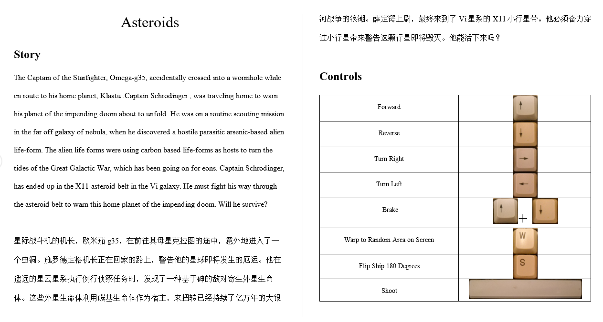

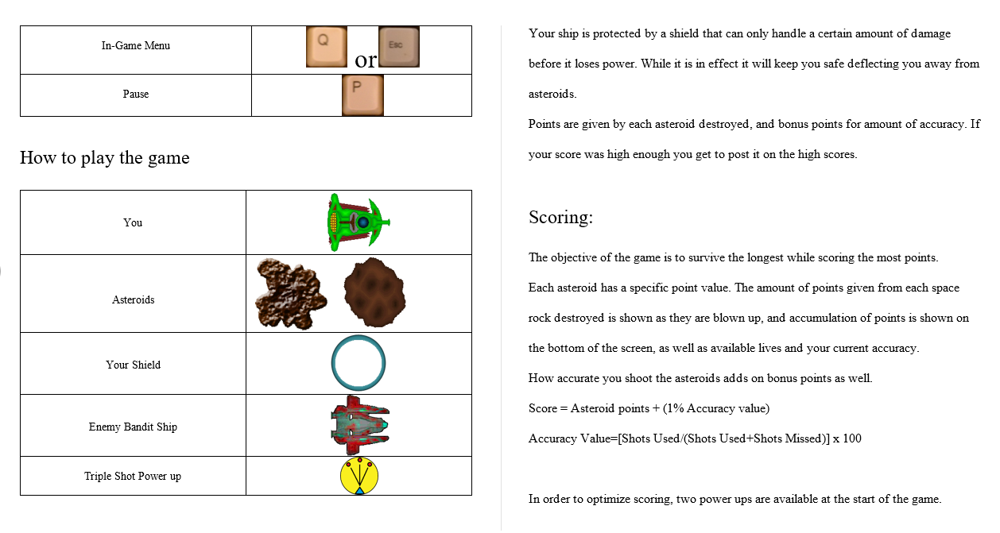

Asteroids! - a Java asteroids implementation in OpenGL for Dave Straayer's CS142 class.

  

<video width="80%" height="80%" controls align-items="center;" justify-content="center;">
  <source src="Story/asteroids_show_case.mp4" type="video/mp4">
您的浏览器不支持Video标签。
</video>

CS142 Course Project: Asteroids Show Case

  

一个阳光明媚的下午，在锡北镇的农村出租屋里， 找到刚毕业时下载的一个有趣的学习项目，阅读并改造它！

  

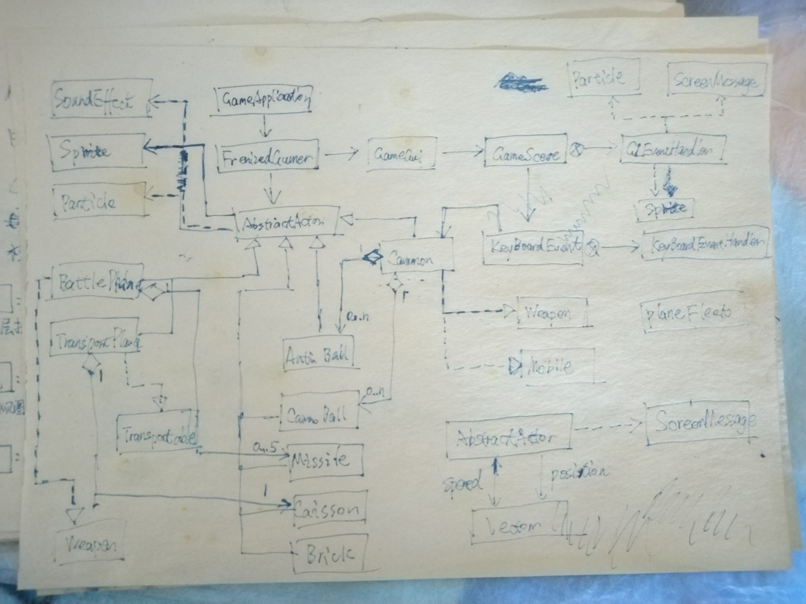

构建自己的想法，一步一步地完善它！ 目标达成的那种成就感可以缓解当时的焦虑感和不自信。

  

(2024.4,  SPCS) 我找到了Crazy的jar包了，无意间在一个俄文网站看到的，立刻反编译了一下，发现变量名都混淆了，没有可值得的参考价值，也没法运行起来，运行环境是jdk1.1版本，代码是2005年写的，看了一下资源文件，和我以前玩的游戏有一些区别，可能是这款游戏在俄罗斯的版本，并且它是比我在2013左右玩的游戏古老。我准备放弃了，中文互联网根本找不到它，唯一的可能看看能否在Motorola E2里提取jar文件了，但是我目前还不准备这样去做，我缺少一款E2的老手机，那是一款可玩度比较高的Linux手机。我又在那个俄文网站上下载了一个模拟器，尝试运行一下这个游戏，可惜失败了，模拟器也没法启动起来，可能我忽略了某些阅读指南文件，我没有心思继续探究下去了。

(2024.5,  Crazy.jar, J2ME Loader) 某天早上逛github寻找提供javax.mircoedition包的J2ME SDK，我看到了一个支持嵌入式设备的模拟器项目，这让我搜索了一下支持J2ME的模拟器，没想到真的找到了一个模拟器app，我想里面一定有我想要找到的东西。顺便把这个游戏运行了起来，它看起来比我以前接触的内容更加丰富。

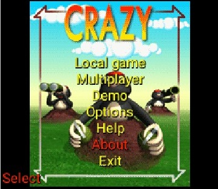

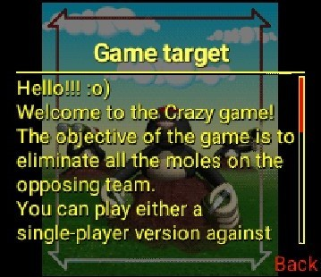

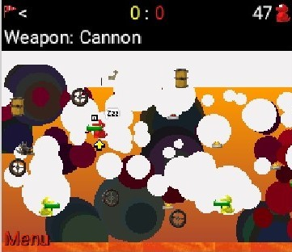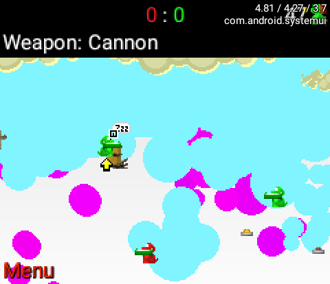
 
它还支持蓝牙连接邀请伙伴加入游戏，还给了一个动态的游戏程序动作回放演示。游戏文件才仅有133KB大小，模拟器中的是诺基亚版本的疯狂鼹鼠，它是一个很古老的游戏。

> #### **Audio** 英语听力播放器

我发现了一个很适合练习听力的材料，但是我没有工具很方便地使用它（它有音频和字幕文件），也许应用程序可以帮助我实现这个想法。我忘记花费多长时间完成这个项目，我记得它是在疫情封控期间被完成的（2022）。一年之后翻看以前的源码，我不敢相信这是我独自写的，可能我现在感觉我没有这样的能力去完成它。值得一提的是我将之前所接触的MVVM架构在这个项目中实践起来了。

Audio 界面设计草图 

> #### LightEditText 富文本编辑器

我在进行DailyNotes手机应用程序开发的同时，也在进行这个编辑器的项目，可是进展非常不顺利，我总是不满足富文本编辑器的样式。尝试了使用了几个文本编辑器开源项目，都不符合我的期望。经过一些尝试，我最终认为编辑器应该提供简单的风格样式，而不必提供多而杂的功能，尤其是在移动端上，其实大多数情况下，它们使用的频率非常低。用户记录的首要目标是文本输入，而不是风格呈现。在这个项目上，我花费了太多的时间去尝试和试错，直到它成为现在这样的状态。回顾整个过程，我发现寻找做什么所花费的时间和精力是多于确定方向后把它实现出来的。

添加链接特性 设计草图

  

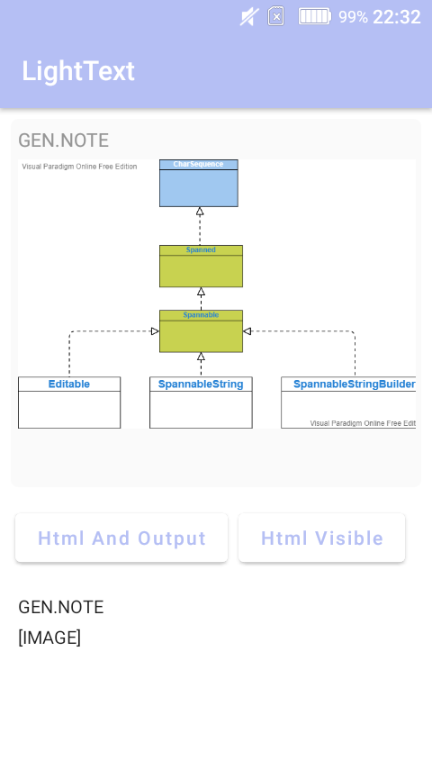

新特性尝试：文本中插入图片

  

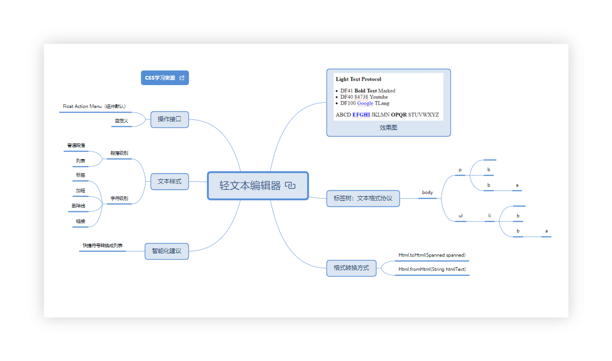

> #### DailyNotes 备忘录项目

让我开始这个项目的缘由，其实是我的手机一直停留在开机界面，我丢失了两年以来所有的记录。手机维修店的老板告诉我主板坏了。手机里面有着这两年多的备忘录没有备份，那段时间感到懊恼，后悔没有将数据同步到云端。

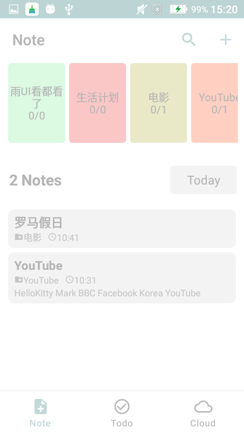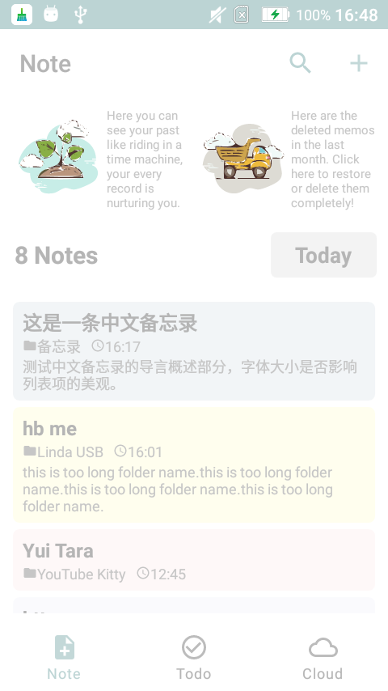

  

拙劣的UI设计，被丢弃的应用程序，频繁迭代的DailyNotes项目让我感到疲惫，这里仅仅展示了冰山一角

  

2021年9月，尝试使用Android开发备忘录应用程序，然而，我并没有完整的Android开发实践经历，一开始我在`MyDiary`项目上修改，随着实践的增多，不断对以前的想法进行否定，直至放弃在开源项目的基础上修改。接着断断续续实现了好几种不同的界面风格，随着审美风格的提升，它们并没有让我感到满意！多次想放弃这个项目，每次想到这个应用会给自己带来一些美好的体验，项目暂停一段时间后又开始有新的想法，这个项目便是以这样的方式进行迭代的。

2022年9月，我对当前的项目状态感到不满意，它看起来像是一个没有经过任何思考准备，随心所欲产生出来的家伙，不论是界面设计还是工程实现层面上的，给我的感觉是它太乱了，没有一点点秩序感。我想是时候改变一下当前的状态了，我花了两个月的时间，从零到一将DailyNotes重新经过整个设计和实现迭代，一切Action围绕这上一层活动展开，层层分解整合。

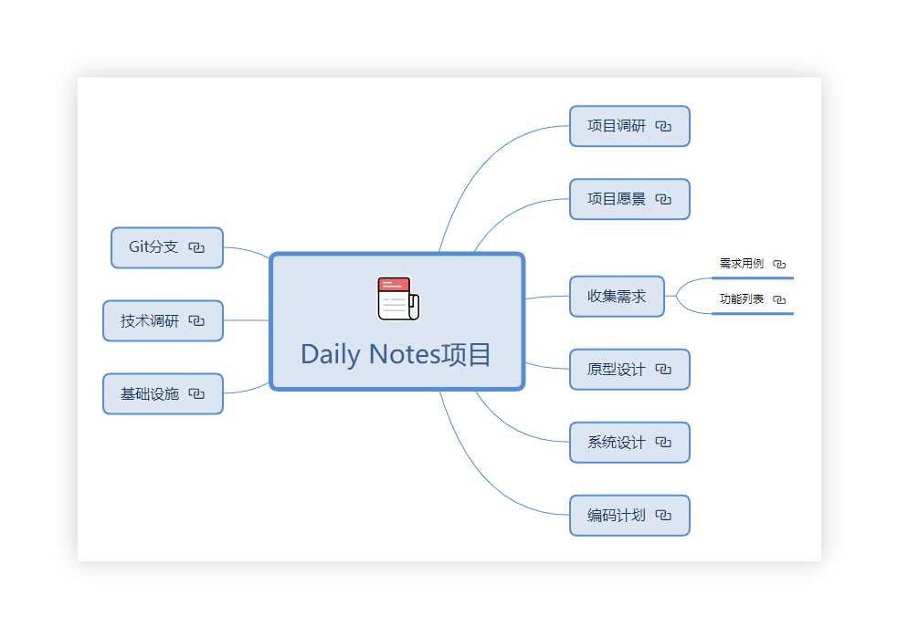

我对界面设计的预期结果是它能够让自己产生文字记录的冲动，如果能够形成正反馈闭环就更好了。经过长时间频繁地修改，我感到有点疲惫和审美疲劳，此时我觉得功能并不是需要现在全部都实现，最好的计划是设计出总体的界面框架，完善当前每个功能的界面，使它们变得实用和精巧，优化体验感，再在此基础上慢慢添加自己想要的功能特性。

`DailyNotes` 使用了谷歌推荐的Jetpack工具包和MVVM架构，在此之前我没有接触过这些工具，不得不感叹技术日新月异的发展，不过它们并不难，让我感到困难的是用户体验设计！做一个能让自己接受的产品很困难，也是我获得进步的机会，即使我不从事与之相关的行业，也能在实践过程中会让自己在某些通用的技能上得到长进。

 

<b>DayNight Mode</b>

也许你看到这样的应用程序会认为它如此简单，根本用不了多长时间，然而我想要说，在刚开始开发它的时候，我天真地认为可能用不了一个月就能够完成它。事实上我错了，只有在实践的过程中，我发现我所需要考虑的远远比自己想象的要多得多！如何管理需求，工程实现代码整洁，整个工具框架以哪种形态搭建以及产品以哪种风格形式去展现出来...... 这些问题都需要按照一定的优先级去一一解决它，它并不是一帆风顺的，尤其是对像我这样的初级开发者来说，走了很多弯路，做了一些无用功，但它是值得的。

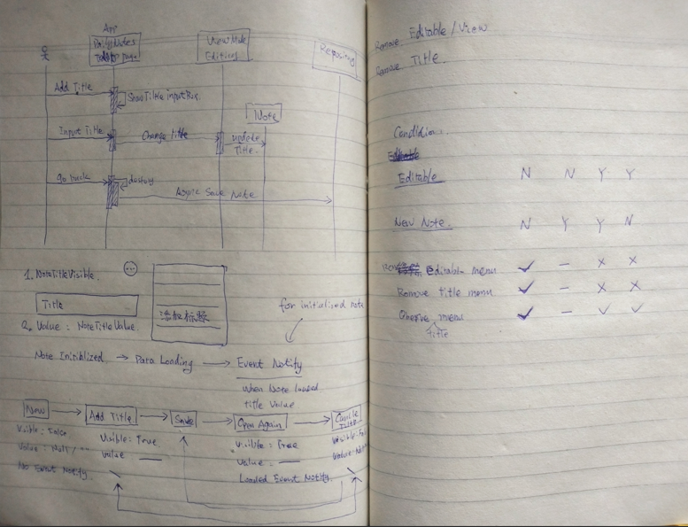

2023年12月29日，好长时间没有接触这个项目了，花费了一个上午的时间基本完成了昨晚在使用DailyNotes时发现的问题。在实现标题输入框一个简单的需求时，出现一些小状况，于是将程序的交互大致流程又了解了一下，才将它实现完成。它们看起来真是太简单了，几乎用不到什么复杂的技术和逻辑，我有时候这样想，我觉得这样的思考并不准确，简单的事做到极致也是一种特殊的复杂，绕过了所有复杂冗余路径的最佳实践！

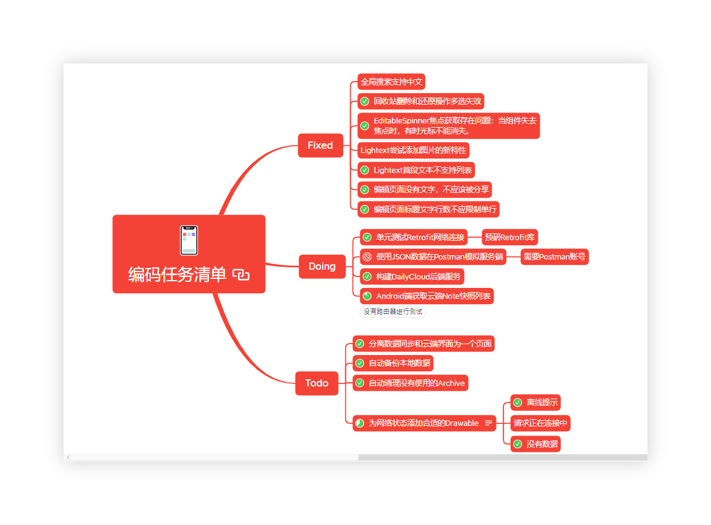

2024年3月下旬刚刚考完驾照，内心感到生活很充实，想顺便推动一下这个项目进度，它有好几个月没有被打开过了，由于分支的使用疏忽，导致测试的时候，发现以前已经修复的问题又出现了，当前开发的分支没有从远程dev分支上更新。于是为了保持分支清晰，本地只保留了一个feat分支。在这个解决版本冲突的过程中，我发现我对Git的使用还是没有具体深入的认识，当然这是有历史原因的。

以前解决不了的问题或者被想象放大的困难，在这几天好像都很轻松地解决了。当DailyNotes需要后端服务时，我又打开了好几年都不曾打开过的IDEA构建了云端服务，Tomcat里曾经运行的demo项目因为没有MySQL数据库而歇菜了，看着以前的小项目列表，让我明白目前的困境是我没有下定某种决心，在内心营造一种清晰明确的目标感和美好的愿景，一个良好的交流环境和强烈的使命感能够促进适宜当下心境的改变。

4月中旬，我觉得我做的已经差不多了，不能再继续开发下去了，待改进的方面会不断地被发现，而我的精力和时间是有限的，该到此为止了，记录一下下次冲刺时需要解决的主要事项。我有时在思考是否坚持把这个项目做下去，这个项目的最终实现对我有什么意义呢，我总是尽量去寻找继续下去的理由。

从构建这个项目的想法出现开始，我想通过这个项目降低我的信心和勇气的势能消减速度，然而我发现，经过这几年，我的心境早已发生了改变，对技术没有以前那样忠实了，也不再认为它能够为我的生活带来一些改变。市面上有很多类似的应用程序做得很优秀，完全可以使用它们，这个项目值得继续下去的理由好像只有数据服务可以本地部署。对开发的时间成本和提供的价值考量，我认为这个项目不能再分配很多时间了，不管出于哪方面的思考，它可能变得不再那么重要了！我需要去做更加重要的事了，一直以来，我将这件事弄错了优先级，事实上，它对我的生活并不重要，却把它放在了不该在的位置上！现在它结束了！（2024.05.01）

