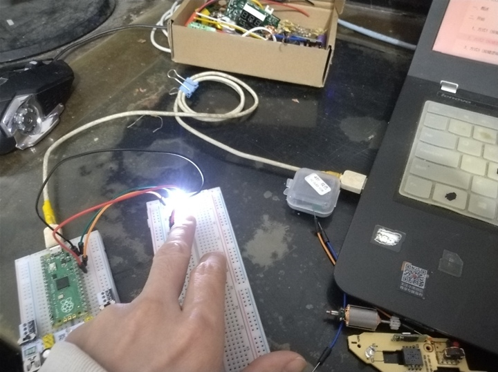
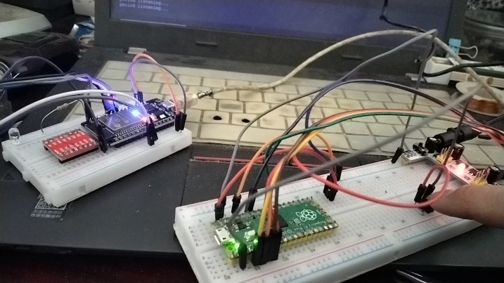
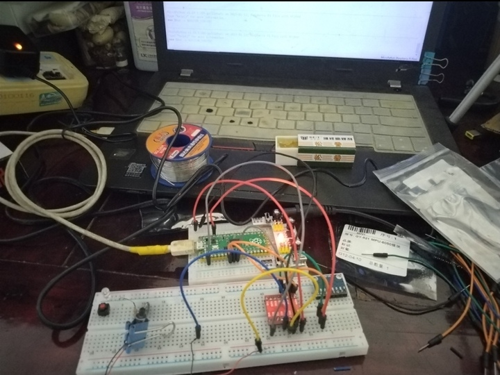

#### 自制固定翼飞行器

2022年，我在网上看了使用乐高积木和树莓派Zero实现了一个遥控潜水艇的视频，觉得整个制作过程非常有趣，于是先买了一个Raspberry Pi Pico，由于当时没有时间和实验环境，板子搁置一年了才点亮它的board led。

项目前期，我对相关的硬件进行了解，买了一些模块配件，进行了一些小测试后发现它们并不符合系统要求。

- 伺服舵机：太大太重（9克/个，相对动力来说，负载太重，输入电压最低5V，集成时需要升压）。
- 通信模块：NRF模块通信距离太短，虽然在购买的时候注意了，买的是加强版的。在测试完后焊接线的时候，模块焊接坏了，准备换其它模块了。
- 电机控制模块：之前有两个微型有刷直流高速电机，因此我买的是直流H桥模块，在测试中我发现直流电机动力太弱，其中有一个电机有点不润滑，也没有买螺旋桨。还是改用无刷电机了，还需要买一个电子调速器，初步设计的航模，电机安装在尾翼，因此螺旋桨需要是反桨。
- 姿态测量模块：内部集成的DMP运动姿态计算功能似乎不起作用，相关寄存器参数已经检查了好多次了，逐步调试，发现FIFO中并没有数据响应。只能使用自定义姿态解算的方式了。虽然DMP能够简化一些测量计算过程，节约MCU的计算资源 ，但是它非常容易坏，可能与芯片里面的结构有关系，其次它计算的结果也不是很准确的，也会发生漂移。基于这些原因，只能被迫使用自定义的姿态解算程序了。
- 电位器：在测试电位器（模拟量转数字量）的过程中，发现在每次操作后，都会有数据波动，如果不是特别精细的调节，应该是不需要进行滤波的，划分区间应该是一个简单的方式。
- 电池：打算使用两块手机锂离子电池串联，为电机和舵机供电，至于MCU供电，单独使用一块迷你的锂离子电池，这样保证电源输出是稳定的，通信模块也不会受到其它模块的影响。使用成品的模块实现就是这样的冗余。
- 交流无刷电机&螺旋桨&升力&载荷：这个没有进行相关计算和试验，目前只能寄希望于降低空载重量，或者选择合适的无刷电机和螺旋桨尺寸了。

测试点对点通信

测试直流电机驱动板

