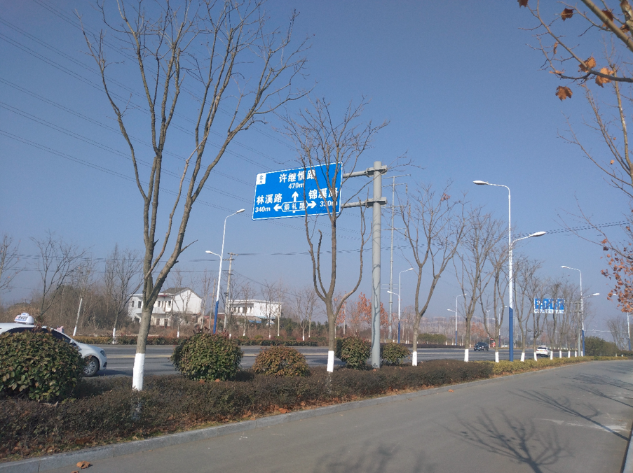
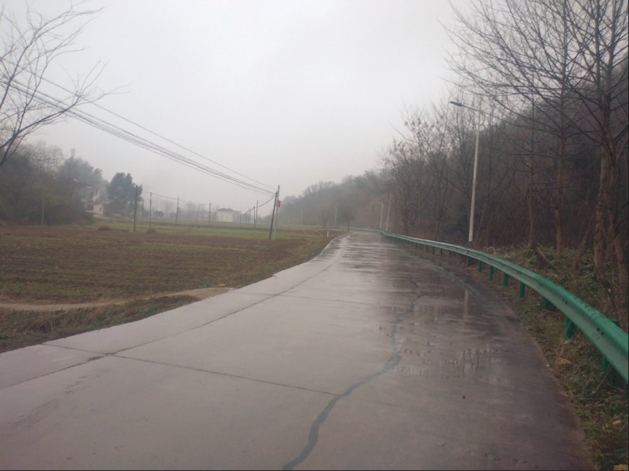

#### C1科目三练习日志

2024年1月9日上午预约了燃气师傅换管子，今天没去驾校。

2024年1月10日，教练中午通知去练练挂档。练习了二三十分钟就回去了。在这个过程中，我发现驻车挡拉起，不管离合和油门怎么踩，都没有使车行驶，当时练习的状态就是这样的。换挡要把离合踩到底，右手将档位归置空挡，然后推至相应档位，离合踏板放到半联动状态停顿一下，然后完全松掉离合，右脚踩油门给油，油门不需要给太多。这里换挡有一个标准，刚起步时，挂一档，稍微给点油，加速到十五千米左右每小时可以挂二档，挂二档后给油，加速到每小时25千米左右，这时可以挂三挡。其中三挡和四档是与空挡在一条线上的，不需要向右偏。

2024年1月11日（day 1，1-3），早上8点来到驾校练练挂挡，发现了自己昨天没有发现的问题。今天开始上路练车，不过我的灯光还没有练习，直接先练习基础操作。明天上午去文化馆，中午到驾校练到下午五点钟，事实上下午三点钟教练有事就结束了训练。现在把整个流程弄清楚，逐项完善，考场路线与驾校科三练习的路线不一样。

📝路过人行横道，公交车站，路口时需要踩刹车，刹车轻踩一下，不能踩重了，踩重了会使速度降低到不属于该档位的速度范围时容易扣分。学校需要保持低速，小于三十千米每小时。

📝车行驶到公交车站实线一半的时候踩一下刹车。如果错过了位置，只要没报不合格，该踩刹车一定要踩，无论系统是否检测到。

📝使用方向盘，手臂放松一点，手扶着方向盘即可，不用抓紧方向盘。直线行驶需要左右微调，遵循“小幅度，高频率”的原则。

📝变道，方向盘打的幅度要小一点，这样可以避免车身压线。

**起步阶段**：车辆在起步时停在路的最右边，进入车内，调整座椅，这里座椅调整至腿脚容易操作的状态；安全带扣上，离合踩到底，右脚轻踩刹车，开启左转向灯，方向盘打九十度，查看左后视镜中左边车道是否有车辆行驶。如果没有，挂一档，松手刹，慢慢松离合，待离合松到车身轻微抖动，松掉刹车，右脚轻放在油门上，左脚松完离合需要放置在一边，不能搭在离合踏板上。当车身变道成功后，关闭左转方向灯；如果有车，等待车辆行驶过去，再进行上述操作（挂档10秒内必须起步）。以一档的速度行驶50m内必须换二档，这时轻踩油门加速到十五千米每小时左右的速度换二档，二档换后给油门，加速到二十五km/h，挂三挡。

**靠边停车**：听到语音播报后，右方向灯打开（结束时不用关闭），等4秒钟，方向盘向右打，幅度小一点，离合踩到底，轻踩刹车，使速度降到每小时10千米左右，换一档。找到道路的中心点向右偏一二十厘米的位置，用方向盘最高点对准，使得车身右侧距离路边实线二三十厘米，看右后视镜中车身距离实线的长度有车内显示屏的宽度，看右后视镜中车身距离实线的长度有车内显示屏的宽度，就可以停车了，离合，刹车踩到底，换成空挡，拉起手刹，关闭发动机熄火。

- 停车前未开或开转向灯少于三秒扣100分；
- 停车后，车身距右侧道路边缘线大于30cm小于50cm，扣10分；
- 停车后，车身距右侧道路边缘线大于50cm，扣100分；
- 停车后，未拉紧驻车制动器（手刹）扣100分；
- 拉紧驻车制动器前放松行车制动踏板（脚刹）扣10分；
- 靠边停车前后，没有观察后视镜的交通状况，不合格。

**掉头**：变道至最左侧，不用关闭转向灯，观察红绿灯。绿灯剩余时间可以掉头，在车经过第二个箭头换二档，行驶路口中间，观察车流，具备继续行驶条件，方向盘向右打满，对准中间车道。行驶到路口一半，有车辆，停车，挂空挡，等待车辆过去，再起步掉头，注意要加档，离合要放掉。如果绿灯剩余时间不够，那么就让车向前行驶到第一个箭头停下，挂空挡，观察红绿灯🚥，当红灯剩下3秒钟时，挂一档，松离合，加油门至15千米每小时，换二档，慢松离合，观察车流，判断是否具备继续行驶条件。

2024年1月12日（day 2，4-6）第一天练习了三次，对训练道路基本了解了，今天在练习中暴露了很多细节上的错误，主要是不了解扣分规则，回来后回顾一下今天遇到的问题。打算明天梳理一下整个项目考核流程和注意事项。

2024年1月16日（day 3，7-9），经过一些调整，今天在练习中存在一些问题：

- 没注意公交站，需要记住公交站位置，行驶到大概位置注意一下。
- 直线行驶，修方向幅度要小，每修一次都要回正一下。
- 踩刹车时，轻一点，方向盘扶正。
- 路口转弯，红绿灯没有观察。
- 换完挡老是忘记松离合。❗️
- 靠边停车，没开方向灯。❗️
- 靠边停车时，找中心点位置有点困难。❗️

2024年1月17日中午 (day 4，10-11) 今天练习的状态不理想，从到驾校时的状态就能够感知到，脑袋昏昏沉沉的，注意力不集中，早知道这样有影响，就推迟练习了，浪费了两次练习的机会。这几天的学习状态不是很好，有了一点倦怠感，可能与前两次练习效果比较差有关。昨天的几个错误没有得到改正，今天下面的错误操作习惯依然没有得到改正：

- 换完挡老是忘记松离合。❗️
- 靠边停车，忘开方向灯。❗️
- 靠边停车时，找中心点位置有点困难。❗️

明天就不用去驾校了，等预约通过了再去，昨天看了一下排名，只有到二月份了才能预约上。

学习状态反思，从学习科三的第一天到现在已经过了7天，按理来说，到现在应该很熟悉了。其实除了练习的时间，剩下的空闲时间很多，一个下午和晚上足够回顾白天所遇到的问题了，但是我没有好好利用这段时间去改，可能受以下四个因素影响：

- 内心烦躁，一些涉及到连环操作，我在脑子里去模拟它，总感觉有阻力，我总想着不去在脑子里模拟场景，感觉思绪很乱，最近生活中的事情让我心烦意乱，每天熬夜睡不着。
- 不当的学习策略，教学视频虽然回去看了好多遍，但是注意力不集中，总是感到只见树木，不见森林。
- 心态变化，这些因素的交互影响，让我对科目三的练习没有像科目二那样专注。
- 生活作息不规律，由于科目三每次练习都是中午，早上我就没有起来那么早了，主要还是晚上熬夜了。说实话，我还是喜欢早起，虽然早上冷，但是头脑清醒。

2024年1月25日预约科目三，到了27日，总共大约有二千二百多人，其中大部分是大学生群体。科目三大概率要延迟到大学生群体寒假结束才能够预约上。起码要等到三月中旬。

1月31日晚上，打开交管12123，突然看到2月4号之后还会放号，上次放号有870个，一共有2200多人，这次每天220个，放四天的号，如果时间上的排名在三分之二以内，有可能在年底前考试。这段时间有点泄气了，科目三的路线又没记了，以为4号之后没有号了。

2月1日，教练让预约7日的考试，在通知前一天我预约了6日，发现自己的排名一直稳定在二分之一的状态。幸好自己的排名在150名以外，6号考试可能会打乱教练的教学计划，明天早上预约7号。（取消预约的机会用完了）

2月19日，预约了27日的考试。

2月21日尽管考虑了天气因素，但是没想到天气情况比我想象的要糟糕多了。现在还在老家，考试预约取消次数用完了，只能等到25号，根据情况在考试预约成功后取消。很明显，情况考虑少了，最好应该到市里面再去预约。

2月27日～29日，看视频模拟动作驾驶

3月1日（day5，12～14）练习记录：

- 起步阶段，如果后方有车，挡切换成空挡，等车道上的车过去，挂一档再起步。
- 变道，方向盘幅度要小一点，大概在30度，最好低于30度。
- 靠边停车，看准点位，中心点向右偏10～20公分。方向盘开始位置大致在中心，向右打一点点，方向盘再回掉。
- 灯光模拟，还需要在家多模拟，训练的时候有一处灯光不熟：人行横道，远近交替需要闪三下。

📌启动发动机，要离合踩到底，向右拧钥匙，如果不踩，发动机启动不了，只是把灯光打开了。
📌加油门，在哪个阶段都可以。只要不是太快导致操作手忙脚乱的，可以根据情况操作。
📌靠边停车完成后，需要检查右方向灯打开了没有（主要是靠边时，方向盘幅度大了导致方向灯灭了），观察右后视镜车身与实线的距离是否满足。当这些都符合，挂空挡，拉手刹（拉手刹前不能松脚刹），熄火。
💡掉头，需要估计时间判断是停还是继续行驶。
🎈科三考试中，需要根据实际驾驶情况判断行驶道路，灵活应变，跟科二有所不同。

3月2日（day6，15～17）练习记录：
🕹路口停车，离合踩到底，脚刹先重踩一下，然后稍微松一下脚刹，待车辆行驶到第一个箭头是踩一下，使其停下。（这样车辆行驶平缓）
📌起步流程梳理清楚：进入车内，核实身份后，听语音播报：“”，下车，逆时针绕车一周，按一下车尾右边按钮和车头左边的按钮；上车，调整座椅，系安全带，检查档位和手刹（观察发动机转速表指针是否在1附近，一般情况车辆是没有启动发动机的，但还是要观察一下），离合踩到底，钥匙向右拧，听到打火，发动机启动的声音，手放开钥匙。模拟灯光；开启左转向灯，方向盘向左打九十度，离合踩到底，轻踩刹车，观察左后视镜是否有车，符合行驶条件，挂一档，放手刹（注意观察手刹是否放彻底），缓抬离合，待车身稍微抖动，慢放脚刹，车头进入车道向右打方向盘90度，车身扶正后，加档…
⚠️靠边停车时，还在调整阶段，不能让车辆停止，稍微松一下离合，右脚松完刹车也要放在脚刹上。一旦车辆停止后再松离合去行驶扣10分。
💡在播报靠边停车之前的距离，保持驾驶位置在道路中间，等靠边停车时，方向盘小幅度向右靠。今天的练习还是在教练的帮助下才完成的，方向盘最高点对准右边边线100厘米左右的位置，根据中间线判断，向右偏10～20厘米。
冲四档，当40千米每小时的速度保持了4秒，踩离合，踩刹车，当速度下降到30千米每小时以下，松开刹车，离合踩到底，换三档，离合松开。

3月3日，（day7，18～20/21～23）凌晨4点半考场实地模拟。下午练习3号线，右转不需要注意红绿灯，油门踩慢一点，科三考试不限时间，心态放轻松。

3月4日，（day8，考试）早上6点50几分坐滴滴打车到达科目三考场，（7:22）进入等待大厅发现已经坐满了人，刚进来注意事项宣讲完。在考试中因没有注意细节和红绿灯，考挂了！感到郁闷和可惜！

中午回来后，简单地吃了一碗饭，下午一点多准备回老家，坐Z号公交车22分钟到了城乡公交站，大概做了一个小时车，又步行了两个小时才到家（18点），此时又累又困。

表层原因分析：

第一次上车，按按钮听不到声音，但是里面确实有声音。安全员让我重新考试。
第二次，模拟灯光完成后，起步阶段，没有第一时间开启方向灯，还没走就挂了。（听到请继续考试，第一步就需要打开左方向灯）。
第三次，调头等箭头指示灯时，看成了红绿灯❌🚥。尽管安全员提醒了，自己的盲目自信造成挂了，应该立即停车。

深层原因分析：

- 早饭没吃，在大厅等了3个多小时，头有点晕。
- 起步前开启方向灯，平时训练没有多注意。感到疲惫时，总是将身体控制权交给潜意识。
- 考前晚上失眠，心里羁绊太多，造成注意力缺失，将红绿灯看错。

科三费用：模拟费（60元），考试报名费（140元），滴滴打车费用（32元）

3月17日，（day9，24～26）14:30，练车
📝二号线调头，方向灯箭头不是同时亮的。超车前，如果不适合变道，可以停下来等待；但是不能在超车变道后去停下来。

3月18日，（day10，27～29）早上八点半，练车
📝绿色箭头灯只剩下3秒左右，就不要继续行驶了，会影响到直行车辆的行驶。
📝科目三靠边停车完成后，注意操作顺序，保证方向灯亮，观察右后视镜，离合，脚刹不能松，直到手刹放掉，或者下车前放开脚刹，熄火操作。

3月19日，（day11，30～31）早上八点练车，**学会适合情况下停车**，今天早上车有点多，练习的情况不太理想，教练让我再练习一次，我说不用了，这不是熟练的问题，练多了容易忘记我前两次的总结和练习过程中的薄弱点。

前面有车，不能抢，可以停车，只要不是超车后阶段都是可以停车等待的。
十字路口右转不需要看红绿灯；
调头，左转弯需要看箭头红绿灯；
调头不需要踩刹车，如果前面有车，可以停下，即使当前车离停车线有一段距离，也是可以停下的，这段距离正好可以加二档。
听到科目指令后，先把方向灯打开，再观察变道道路车辆情况。
考虑下个进行的项目是冲四档，前面有车会有影响，可以停车等待。

3月20日，（day12，考试）科三考试通过😀。9:30，阳光明媚的一天。
考试结束没有语音播报，操作完成后，熄火，观察左后视镜下车即可。考完试后，安全员说你再不下车，我就要踩刹车了，等了二十多秒😤。

<b>科三考试通过后，走出考试中心，在路边等36路公交车。</b>

此时有一种强烈的愉悦感冲击我的脑袋右半部分区域。坐在公交车上，还在回想刚才的过程，运气真是好，路上车并不多。上次考试是17号车，三个中只有一个过了，分别是两个年龄大的和一个年轻人，这次也是。最后一个人考试的过了，不同的是，这次我是最后一个考试，之前我是第一个考试的。

考试费用（140元），出租车费（23元），工本制作费（10元），科二科三公交费用（63.5元），整个学车过程花费2528.5元。

3月21日，科目三理论常识考试通过（98分）。有一题是不确定造成的，不过不用太在意分数，重要的是目标达成，理性看待丢分问题，刻意地追求完美，反而获得不到目标达成的愉悦感！下午领证😀。心境的旋律🎶：Someone You Loved，《星际穿越》BGM。

⚠️自主变道成功后方向灯一定要关闭，前方选择合适位置掉头，不需要关闭方向灯。
⚠️可以直接越级减档 不能越级加档
⚠️科目三中，离合器操作遵循“快踩慢抬”原则；刹车操作遵循“慢踩快抬”；油门操作遵循“慢踩慢抬”。
⚠️离合踩到底后，才能换挡
⚠️汽车全程行驶以三档为主。变挡后，需要换挡成三档。
⚠️距离限制：超车距离150米以内，靠边停车150米以内，变道120米以内，一档50米以内；二档250米以内，考试车辆二档在400米以内；三档不限。
⚠️在夜间灯光模拟过程中，车事故停车完成相应的灯光是在下一个灯光模拟时进行关闭。

