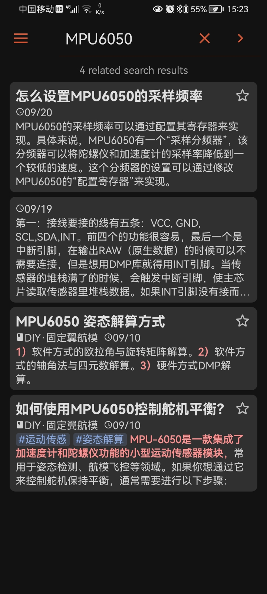
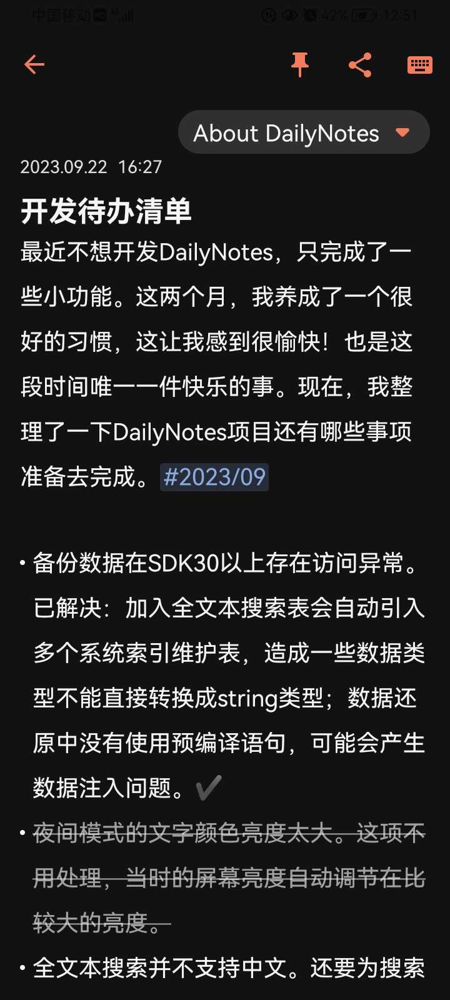

#### DailyNotes更新日志

`2025年4月`，重构部分功能特性代码，修复一些已知的问题。`0.8.35`

- 修改部分界面组件。
- 增加Note列表项对图片短句的场景处理。
- 重构设置中还原备份功能异常处理代码。
- 重构文件操作类的使用方式。
- 修复缓存文件自动清理的问题。
- 修复DayNight的自动模式设置无效问题。
- 重新设计导出html文件的css样式。
- 清理一些无用的代码和资源文件。

NOTE: 不确定模式进度条在PreferenceScreen界面中无法正常显示进度动画，系官方组件的功能BUG。

  

`2025年3月`，修复已发现的问题，重构附件界面。`0.8.24`

- 修复：备份-还原过程中，数据膨胀。
- 修复：批量删除和自动清理备忘录，附件文件删除失败。
- 修复：操作搜索结果列表，没有更新响应。
- 修复：切换夜间模式，应用崩溃。
- 重构：数据还原过程中的数据访问方式；图片编码存取方式。
- 重构：使用底部弹窗替代附件界面。并修复两个问题：
  - 图片列表数据改变后，视图没有响应刷新。
  - 设置照片墙无效。
- 优化：搜索提示匹配历史列表，点击触发搜索响应。
- 清理无用的资源和权限声明，调整一些风格元素。

  

`2025年2月`， 完善一些已发现的问题。`0.8.11`

- 修复：外置存储SD卡备份异常。
- 修复：NoteBook名称输入提示及提示弹窗宽度测量。
- 修复：导出网页文件中标签内部出现空格换行问题。
- 修复：快速创建图片备忘录，图片命名不能作为引用地址。
- 新特性：文本编辑器新增时间戳。
- 更新部分UI组件风格。

NOTE: 在文本编辑器的需求验证中，输入和输出过程的中的换行格式一致的条件在Span和HTML相互转换过程中不能满足逻辑自洽。因此放弃取消目前格式自动化处理的功能特性。

  

`2024年12月`，新增备份位置，列表多选操作，改变夜间风格。`0.8.2`

- 重构本地备份，默认外置SD存储卡为备份位置。
- 新增列表多选操作；移除回收站界面；添加回收站过滤器。
- 重构搜索流程。
- 重构附件列表界面。
- 修复已发现的问题。

  

`2024年11月`，移除云同步基础代码。`0.6.15` 清理无用的功能特性，添加一些新的特性。

- BREAK UPGRADE: 删除云同步基础设施代码。
- BREAK UPGRADE: 删除后台定时闹钟提醒功能代码。
- 新增文本编辑风格：图片编码。
- 新特性：导出HTML。
- 修复已知存在的问题。

  

`2024年8月`，移除文件夹界面。 `0.6.3`  添加一些新特性，修复已知问题。

- BREAK UPGRADE: 归档文件夹改为笔记本，重新定义归档概念。
- 修复：还原数据，更新全文搜索数据。
- 修复：备忘录过滤列表，操作后数据列表更新不正常。
- 新特性：快速创建图片备忘录。
- 新特性：备忘录定时提醒。
- 新特性：在指定笔记本过滤列表中快速创建所属备忘录。
- 添加编辑界面属性描述（修改时间，字数统计，备忘提醒时间，etc...）。
- 修复已发现的小问题。
- 优化一些操作使用体验。

    
    

  

`2024年7月`，`0.5.18`  完成了全文本搜索对中文的支持。

- 全文本搜索，搜索建议优化，调整搜索输入框组件风格。
- 调整Note首页界面，集成搜索界面到导航地图。
- 增加数据库预填充数据。
- 删除文本编辑风格：加粗和链接。
- 新增文本编辑风格：高亮文本。
- 修复一些已发现的问题。

  

`2024年6月`，自动化构建测试发布版本。（2days)

  

`2024年5月`，完善现有的功能，修复一些已知的问题。（3days)

- 提高还原数据的版本兼容性。
- 列表页中选择重新归档，提供空选项。
- 为部分页面添加转场动画，实现共享元素转换。
- 自动化任务执行后，通知提醒。
- 过滤器名称和浮动按钮随列表滑动进行可见性联动。
- 实现Undo和Redo基础功能，仅支持原生Android的文本编辑。
- 分享纯文字。

  

`2024年4月`，新增后台任务运行，修复一些已知问题。（10days)

- 构建DailyNotes后端服务。
- 新特性：自动备份本地数据。
- 新特性：自动清理没有使用的归档名称，回收箱中的备忘录。
- 新特性：备忘录列表项概述文本区域支持显示列表风格。
- 修复归档输入框的焦点问题。
- 修复签名打包后UI可见性问题。
- 修复回收箱中批量删除和还原操作多选失效问题。
- 修复编辑页面没有文字不分享。
- 调整文本编辑器的参数，清理无用矢量图资源。
- 调整操作界面，优化体验。

    
    

  

  

`2024年1月`，为实现云端同步功能作准备，目前我没有局域网的环境支持。

- 重构空列表布局。
- 修复因清理代码过程中失误造成数据还原异常。

  

`2023年12月` 完善现有功能，并修复已发现的ISSUES.（Only 2~3 Hours)

- 编辑界面添加滑动编辑器，组件联动效果。
- 软件可以根据用户需求，添加标题或者隐藏标题输入框。
- 调整英文翻译和夜间模式中文本颜色。
- 修复回收站的备忘录条目的文本行数限制和空描述占位问题
- 修复文本编辑器不能复制和剪切功能。
- 修复图片分享中的日期格式问题。

  

`2022年9月`-`2023年10月`，DailyNotes已完成下列功能：

- 基本的完整编辑笔记流程
- 插入附件（仅图片）
- 分享笔记，仅完成最基本的功能
- 浏览/编辑模式
- 过滤器（所有，今天，收藏，收件箱，已归档，已删除），列表分页显示
- 白天/夜间模式
- 支持语言风格（中/英）
- 数据备份/还原，仅完成最基本的功能
- 全文本搜索，未完成对中文的支持

    
    

  

?><a title="DailyNote App" style="text-decoration: none;" download="app-release.apk" href="">Download APK (Release, 2.27 MiB) </a>