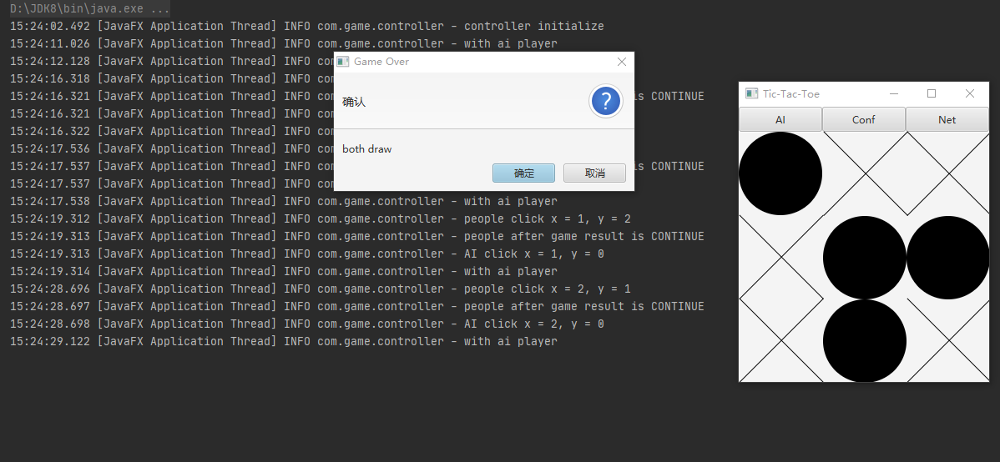
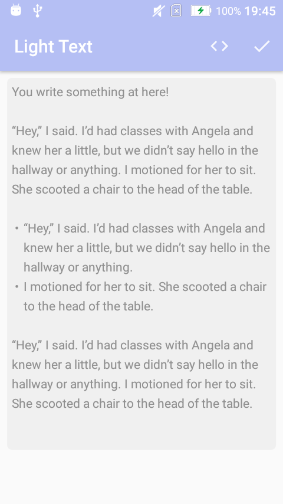
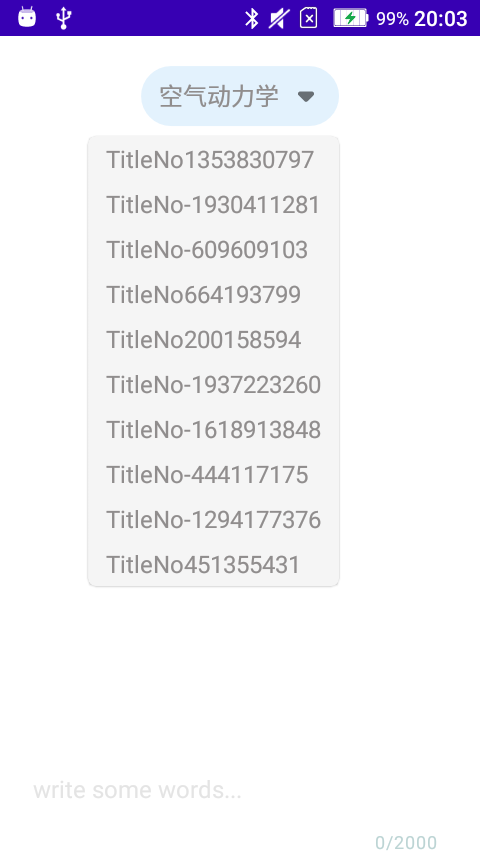
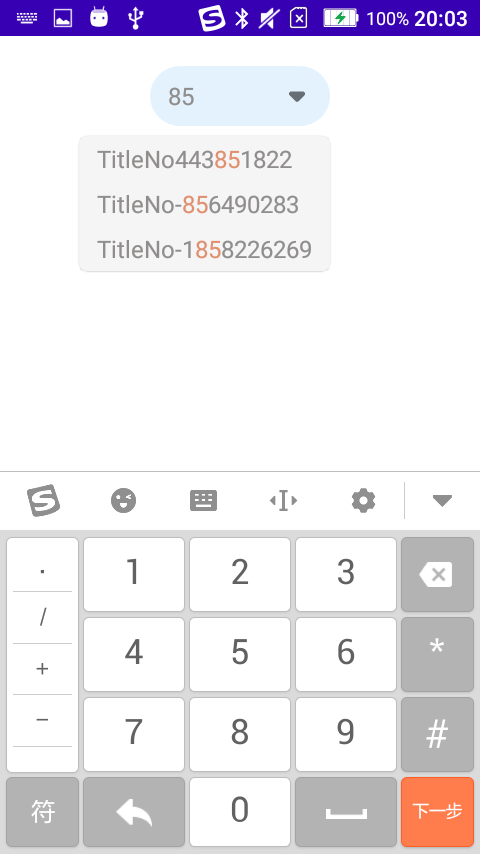
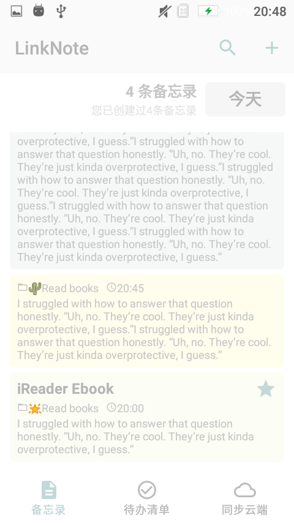
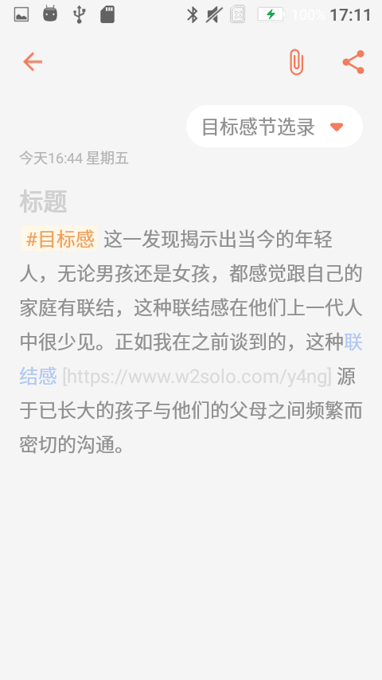

> #### Toy Projects
> 

- **Crazy** （🕹️疯狂的大炮，练习重构，Git工具，OOD 案例项目）
- **Tic-Tae-Toc**（🕹️井字棋，练习网络编程，Socket案例游戏项目，回溯算法，极大极小α-β剪枝算法）
- **Audio** （英语听力播放器，Android端）
- **NEditArea**（基于Layout实现的文本编辑器，开源项目重构）
- **LightEditText** （基于Span实现的文本编辑器，开源项目二次开发，代码设计👍）
- **EditableSpinner**（可编辑的Spinner组件，开源项目重构）
- [**DailyNotes**](Articles/20231126.md)（每日备忘录应用程序，🚀Developing...）
- [**SketchBoard**](Articles/20240828.md)（🎨图片标注板，🚀Developing...)

> #### Show Case
>

Crazy 游戏项目
  

Crazy Show Case
  

井字棋游戏项目（AI, 网络连线对战）
  

井字棋 AI Show Case
  

井字棋本地网络端口连接 Show Case
  

英语听力播放器
  

基于Span的富文本编辑器（DailyNotes项目组件库）
  

具有编辑能力，输入可自动提示的Spinner（DailyNotes项目组件库）
  

迭代开发中的DailyNotes项目
  

图片标注画板
  

